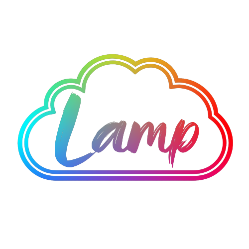

# Cloud-Lamp

ESPHome firmware for a small 3D-printed decorative cloud lamp, built around a Wemos D1
Mini (ESP8266) driving three WS2812 LED rings. The lamp is designed as a personalised
gift — for example with a child's name and birth details printed on the front — and is
fully usable as a standalone lamp with a single push-button, with optional Wi-Fi control
through a built-in web app.



## Features

- **Standalone-first** — on/off, effect cycling and dimming always work from the
  push-button alone. Wi-Fi and MQTT are optional extras that can never block or reboot
  the lamp.
- **Multi-gesture button** — single press toggles the lamp, double press switches to the
  next effect, press-and-hold dims up/down (alternating, Hue-style). Holding the button
  while plugging the lamp in performs a factory reset (with a red countdown animation as
  warning).
- **27 light effects** — 18 solid colours in spectrum order (White first, then one
  continuous hue sweep from blue through violet, pink, red, orange, yellow and green; all
  tested on-device with the web app's colour picker) plus special effects (Aurora Drift —
  the default on a lamp's first-ever power-on — Sky Breathing, Candlelight, Spectrum Fade,
  Spectrum Flow, Twinkle, Blue Color Wipe, Rainbow, Pulse), all tunable via substitutions
  in `effects.yaml`.
- **Effect speed** — live 1–100 slider in the web app for animated effects (persisted;
  50 = the calm defaults). Solids hide the control.
- **Custom colour** — a *Custom color* button in its own section of the web app opens the
  device's native colour picker (the iOS system picker on iPhone/iPad); the picked colour
  is remembered like an effect and survives power cuts. A double press on the button
  returns to the effect presets.
- **iOS-style web app** — served directly from the lamp, no cloud, no app store.
  Progressive Web App: open the lamp's address in Safari, "Add to Home Screen", and it
  behaves like a native app. Power, brightness, speed, effect selection, settings and
  firmware updates; localised in ten languages (English, German, Spanish, French,
  Italian, Dutch, Polish, Portuguese, Turkish, Russian).
- **Simple Wi-Fi onboarding** — if the lamp doesn't know the local Wi-Fi it opens its own
  hotspot (`Cloud-Lamp-XXXXXX`) with a captive portal to enter credentials, using a
  branded setup page in the same design (and languages) as the web app. No flashing or
  tooling needed to move the lamp to a new home; credentials survive firmware updates.
- **Safe over-the-air updates** — the lamp checks for new firmware (automatically every 6
  hours, and on demand from Settings) and offers updates in the web app. The update
  manifest is Ed25519-signed and verified on-device before anything is trusted; the
  firmware image itself is MD5-verified and written to a separate flash region. A failed
  or interrupted update leaves the running firmware untouched, and a boot-loop triggers
  ESPHome safe mode.
- **Optional MQTT integration** — for ioBroker / Home Assistant setups. Off by default on
  every lamp; turn it on and enter your broker's address/port/username/password directly
  in the web app's settings (Settings → MQTT) — no reflash needed, and the values stay
  saved if you turn MQTT off again.
- **Optional thermal protection** — a DS18B20 sensor package that shuts the LEDs off if
  the case overheats and re-enables them after cooling down.

## Hardware

| Component | Details |
|---|---|
| Microcontroller | Wemos D1 Mini (ESP8266) |
| LEDs | 3× stacked WS2812 rings, 24 LEDs total (GRB) |
| LED data | GPIO03 (RX) through a 330 Ω series resistor |
| Capacitor | 470 µF electrolytic across the 5 V rail |
| Button | Momentary push-button on GPIO12 (D6) to GND, internal pull-up |
| Power | External 5 V / 2 A DC adapter, barrel jack 5.5×2.1 mm, centre-positive |
| Optional | DS18B20 temperature sensor on GPIO4 (D2) |

The LED count, pins and other build parameters are substitutions at the top of
`cloud-lamp.yaml`, so the firmware adapts easily to different ring counts or boards.
Wiring details and the power budget are documented in
[docs/cloud-lamp-design.md](docs/cloud-lamp-design.md#hardware).

**3D printing:** the lamp shell is a 3D-printed cloud (PLA) with the personalised text on
the front. The print files are planned to be published here as well.

## Getting started

Requirements: [ESPHome](https://esphome.io) (CLI or Docker) and Python 3.

```bash
git clone https://github.com/danieldriessen/cloud-lamp.git
cd cloud-lamp

# Create your credentials file from the template and fill in your values
cp secrets.example.yaml secrets.yaml

# Build and flash (first flash via USB, afterwards OTA)
esphome run cloud-lamp.yaml
```

After flashing:

1. Power the lamp — it works immediately from the button.
2. Connect a phone to the lamp's setup hotspot `Cloud-Lamp-XXXXXX` (XXXXXX = last 6 hex
   digits of the chip MAC, on the sticker) and enter your Wi-Fi credentials in the
   captive portal that opens.
3. Open the web app at `http://cloud-lamp-<serial>.local/` (same six hex digits,
   lowercase — e.g. `http://cloud-lamp-cfb911.local/`) or at the lamp's IP. On iPhone /
   iPad you can optionally add it to the home screen from Safari.

Two build configurations exist:

- **`cloud-lamp.yaml`** — the standard build. Wi-Fi is configured entirely through the
  captive portal; nothing network-specific is compiled in.
- **`cloud-lamp-dev.yaml`** — a development build that additionally compiles in Wi-Fi
  networks from `secrets.yaml`, convenient for bench work. MQTT is already part of the
  core firmware (`cloud-lamp.yaml`) and is configured from the web app on either build.

To iterate on the web app without hardware, run `python3 tools/mock-device.py` and open
`http://127.0.0.1:8932/`.

**Note on updates:** firmware built from this repository checks a plain-HTTP manifest URL
(`update_manifest_url` in `cloud-lamp.yaml`) for new releases, and verifies its Ed25519
signature against a public key baked in (`ota_ed25519_pubkey`) before trusting it — see
[docs/firmware-updates.md](docs/firmware-updates.md) for the full mechanism and
`tools/release.sh` for the release/signing/publish workflow. If you fork the project,
generate your own keypair, point `update_manifest_url` at your own host and
`ota_ed25519_pubkey` at your own public key (or remove the `updates` package) — reusing
this project's keys or manifest URL means your lamps would trust *this* project's releases,
not yours.

## Documentation

| Document | Contents |
|---|---|
| [docs/user-manual.pdf](docs/user-manual.pdf) | **End-user manual (PDF)** — safety, button gestures, Wi-Fi setup, updates, troubleshooting. Permanent URL (linked from the web app's book icon and the sticker QR code). Generated from [docs/user-manual.md](docs/user-manual.md) by `tools/build-manual.py` |
| [docs/cloud-lamp-design.md](docs/cloud-lamp-design.md) | Architecture, behaviour reference (button/boot/web/MQTT), hardware, changelog |
| [docs/device-credentials.md](docs/device-credentials.md) | Setup-hotspot naming, product sticker contents (required/optional fields for `docs/Label.lbx`), credential handling |
| [docs/firmware-updates.md](docs/firmware-updates.md) | Update paths, safety guarantees, release workflow |
| [docs/hand-lamp-reference.md](docs/hand-lamp-reference.md) | Predecessor project reference (historical) |

## Repository layout

```
cloud-lamp.yaml            main firmware configuration
cloud-lamp-dev.yaml        development build (adds compiled-in Wi-Fi networks)
effects.yaml               light effects and tuning parameters
secrets.example.yaml       template for the required secrets.yaml
packages/                  feature modules: web app, updates, MQTT (off by default), temperature sensor
components/cloud_lamp_web/ custom ESPHome component serving the web app
components/signed_update/  custom `update:` platform: plain-HTTP + Ed25519-signed manifest check
web/                       web app + Wi-Fi setup page (embedded into the firmware at build time)
assets/                    artwork sources (project wordmark, PWA/header derivatives, logos)
assets/cloud-lamp-logo.png project wordmark (README hero + source for web/brand + web/icon)
web/brand.png              header wordmark (embedded as /brand.png)
web/icon.png               home-screen / PWA icon (embedded as /icon.png; transparent trial)
docs/                      project documentation
docs/firmware-dist/        published firmware releases (online update channel, served via GitHub Pages)
docs/Label.lbx             P-Touch label template for the sticker on the back
tools/                     development and release helpers
```
